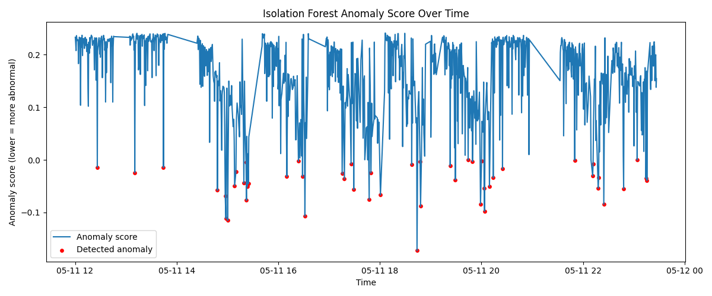
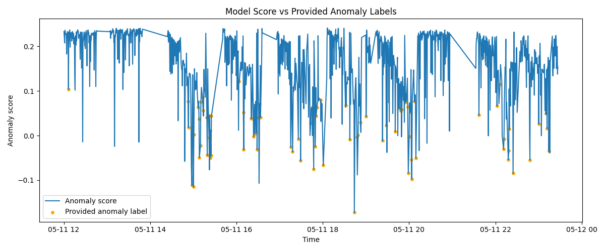
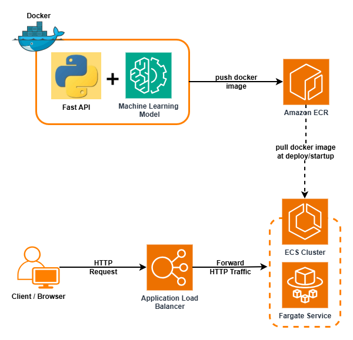
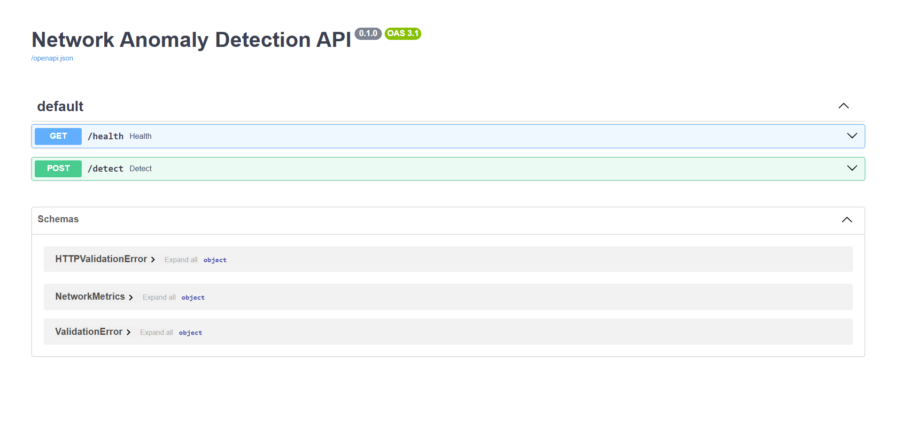
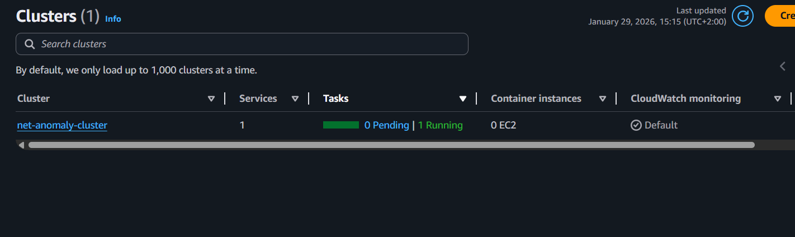

# 🚀Network Anomaly Detection – ML + AWS Deployment

End-to-end project for detecting network anomalies using machine learning and deploying the model as a production-ready API on AWS.

This project demonstrates a **full AI engineering pipeline**:
data preparation → model training → validation → API serving → containerization → cloud deployment.

---
## ❓What problem are we solving?

Reliable network connectivity is essential, and early issue detection helps prevent failures, minimize downtime, and maintain service quality.

---
## 📌Project Overview

The goal of this project is to detect anomalous behavior in network telemetry data
(e.g. throughput, latency, packet loss, jitter) using an **unsupervised machine learning approach**.

An **Isolation Forest** model is trained and then deployed as a **REST API** using **FastAPI**, **Docker**, and **AWS ECS (Fargate)** behind an **Application Load Balancer**.

---
## 🤖Why Isolation Forest?

- Designed for anomaly detection when abnormal events are rare  
- Does not require labeled downtime data  
- Fast and scalable for large telemetry datasets  
- Produces an anomaly score to measure how unusual each data point is

---
## 🔧Pipeline Steps

1. Data cleaning & feature selection  
2. Feature scaling (StandardScaler)  
3. Model training with contamination tuning  
4. Anomaly scoring and thresholding  
5. Validation against provided anomaly labels  

---

## 📊Results & Validation

### Anomaly Score 

### Comparison between detected anomalies and labeled anomalies 

---
## ☁️ Cloud Deployment (AWS)

The API is deployed on AWS using:

- **Docker** – containerized application
- **Amazon ECR** – container image registry
- **Amazon ECS (Fargate)** – serverless container runtime
- **Application Load Balancer** – public HTTP access
- **FastAPI + Uvicorn** – API framework and ASGI server

---
## 🏗️ System Architecture

---

## Deployment proof

| | |
|---|---|
| Swagger UI running on AWS | ECS service running |
|  |  |

---

## 📦 Tech Stack

Python, Scikit-learn, Uvicorn, FastAPI, Docker, AWS (ECR, ECS, ALB)  
